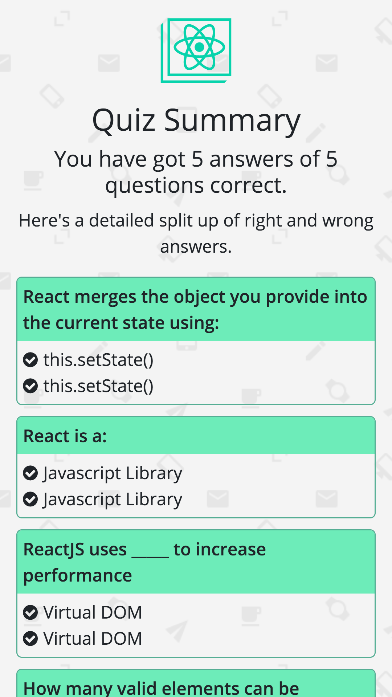

## Creating a Quiz Application & showing Results using States

This repository contains the code for the accompanying SitePoint Blog Post [Creating a Quiz Application & showing Results using States](https://blog.praveen.science/). This application is built using React JS and it uses a constant `Questions.js` to render the questions. Some features include:

- Nice & Beautiful Mobile User Interface.
- Mobile First Design using Bootstrap.
- Beautiful Splash Screen.
- Summary of all answers - correct & incorrect.
- Next button displays only after selecting an answer.

## Screenshots

**Splash Screen**

**Question**

**Summary**

